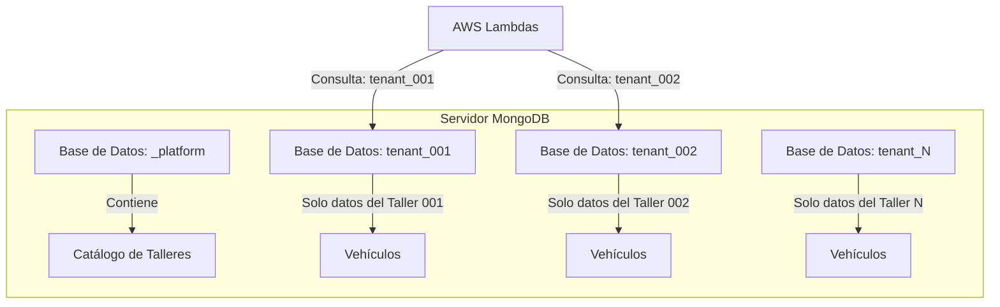

# Módulo: Multi-tenancy y Almacenamiento

## Objetivo

Establecer las directrices de seguridad y arquitectura para el manejo de datos multi-tenant, garantizando aislamiento absoluto de la información entre los talleres (clientes) del sistema.

---

## 1. Arquitectura de Aislamiento (Schema-per-Tenant)

Para garantizar la máxima seguridad y simplicidad en las consultas, se adopta una arquitectura de "Schema por Tenant" (Base de Datos por Tenant).

### 1.1. Estructura Física

El servidor de MongoDB contendrá múltiples bases de datos (esquemas). Cada base de datos será independiente y pertenecerá exclusivamente a un taller.



### 1.2. Catálogo de Talleres (`_platform.talleres`)

Esta base de datos centralizada almacena la metadata necesaria para la gestión de los tenants:

| Campo | Descripción |
|-------|-------------|
| `tenant_id` | Identificador único del taller (UUID). Se usa como sufijo/prefijo en la DB. |
| `tenant_db` | Nombre físico de la base de datos (ej. `tenant_001`). |
| `nombre_comercial` | Nombre del taller. |
| `estado` | Activo / Inactivo. |
| `fecha_suscripcion` | Fecha de alta. |
| `modelo_licencia` | Básico / Pro / Enterprise (Define features y límites). |

---

## 2. Manejo de Datos y Transacciones

El backend Serverless en Python (AWS Lambdas) será el orquestador que determine en qué base de datos ejecutar cada operación.

### 2.1. Aislamiento por Transacción

En caso de operaciones complejas que involucren múltiples colecciones (ej. crear un vehículo y una orden de servicio al mismo tiempo), se debe utilizar una sesión de cliente de MongoDB en Python (`pymongo`).

```python
# Pseudocódigo Python para Transacción con Múltiples Colecciones

# 1. Iniciar sesión
with mongo_client.start_session() as session:
    try:
        with session.start_transaction():
            # 2. Obtener la base de datos del Tenant
            db_tenant = mongo_client[f"tenant_{tenant_id}"]
            
            # 3. Operación A: Crear Cliente en DB del Tenant
            db_tenant["clientes"].insert_one(cliente, session=session)
            
            # 4. Operación B: Crear Vehículo en la misma DB
            db_tenant["vehiculos"].insert_one(vehiculo, session=session)
            
            # 5. Operación C: Crear Orden de Servicio en la misma DB
            db_tenant["ordenes"].insert_one(orden, session=session)
            
            # Si el bloque 'with' termina sin errores, se hace commit automáticamente
    except Exception as e:
        # Si algo falla, se aborta la transacción
        raise e
```

### 2.2. Criterios de Decisión de Base de Datos

| Tipo de Operación | Lógica |
|-------------------|--------|
| **Interrogación (Query)** | 1. Obtener `tenant_id` de los claims de Cognito en el `event['requestContext']['authorizer']`. <br> 2. Conectar a la base de datos `tenant_{tenant_id}`. |
| **Escritura (Save/Update)** | 1. **Obligatorio:** Obtener `tenant_id` del contexto de seguridad. <br> 2. Si es nulo → **Retornar 403 Forbidden** (Fuga de datos). <br> 3. Ejecutar operación en la base de datos correcta. |
| **Operación Global (Catálogos)** | Solo aplica a la base de datos `_platform`. |

---

## 3. Requerimientos de Seguridad (Security Requirements)

### 1. Aislamiento de Datos (Data Isolation)

- **Prohibición de Datos Huérfanos:** Ningún registro puede ser creado sin un `tenant_id` válido asociado.
- **Validación de Pertenencia:** El API Gateway o la Lambda validará el token JWT y extraerá el `custom:tenant_id` de forma segura.

### 2. Autenticación vs. Autorización (AuthN vs AuthZ)

- **Autenticación (AuthN):** Realizada por AWS Cognito. El sistema confirma quién es el usuario mediante JWT.
- **Autorización (AuthZ):** Realizada por las Lambdas verificando el claim `cognito:groups` en el token JWT.

---

## 4. Guía de Implementación para Desarrolladores

### 4.1. Configuración del Proveedor de Base de Datos (Python Layer)

Para soportar el entorno multi-tenant en Python, utilizaremos una clase Factory o Singleton que resuelva dinámicamente la base de datos basándose en el `tenant_id` inyectado por el middleware (o directamente en el event de la Lambda).

```python
from pymongo import MongoClient

class DatabaseFactory:
    _client = None

    @classmethod
    def get_client(cls, uri):
        if cls._client is None:
            cls._client = MongoClient(uri)
        return cls._client

    @classmethod
    def get_tenant_db(cls, uri, tenant_id):
        client = cls.get_client(uri)
        if tenant_id:
            return client[f"tenant_{tenant_id}"]
        # Si no hay tenant_id y se requiere acceso a la plataforma (solo SuperAdmin)
        return client["_platform"]

# Uso en los handlers:
# def lambda_handler(event, context):
#     tenant_id = event['requestContext']['authorizer']['jwt']['claims'].get('custom:tenant_id')
#     db = DatabaseFactory.get_tenant_db(MONGO_URI, tenant_id)
#     coleccion_vehiculos = db["vehiculos"]
```

De esta forma, cualquier operación escribirá o leerá automáticamente en la base de datos del taller autenticado.

Cuando se haga una solicitud a la base de datos y no se especifique el tenant_id, deberá ir a consultar a una base de datos global, por ejemplo para obtener la lista de vehículos (modelo, marca, etc) o la lista de los talleres
---

## 5. Alta de Taller

### 5.1. Campos Requeridos

- `nombreComercial`
- `modeloLicencia` (BASICO, PRO, ENTERPRISE)
- `adminEmail`
- `adminNombre`
- `adminApellido`
- `adminTelefono`
- `fechaAlta`

### 5.2. Flujo de Creación

Cuando se crea un taller (POST `/admin/talleres`), se debe:
1. Generar un `tenant_id` único mediante UUID (`uuid.uuid4()`).
2. Crear la entrada del taller en la base de datos global (`_platform.talleres`).
3. Dar de alta el usuario administrador en AWS Cognito asignándolo al grupo `ADMIN`.
4. Inyectar el atributo `custom:tenant_id` en el perfil de Cognito del administrador.
5. Iniciar la provisión de la base de datos propia del tenant (ej. `tenant_{uuid}`).

### 5.3. Endpoint

**POST** `/admin/talleres`

**Body:**
```json
{
  "nombreComercial": "Taller Ejemplo",
  "modeloLicencia": "BASICO",
  "adminEmail": "juan@tallerejemplo.com",
  "adminNombre": "Juan",
  "adminApellido": "Perez",
  "adminTelefono": "55555555",
  "fechaAlta": "2022-01-01"
}
```
